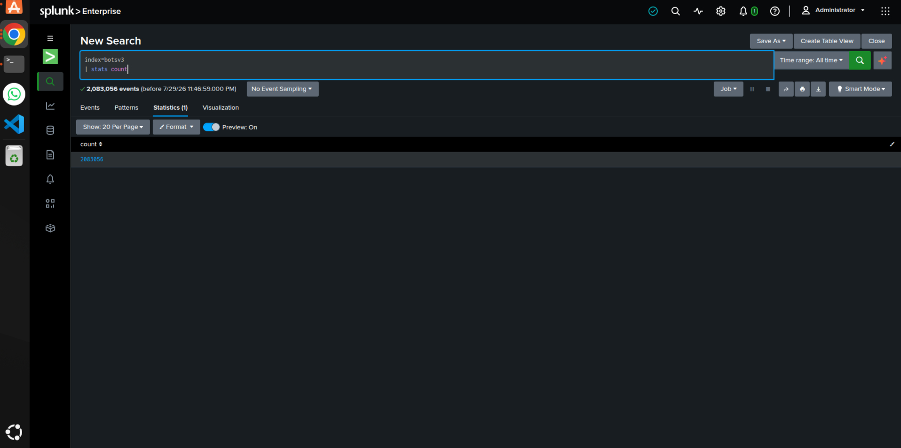
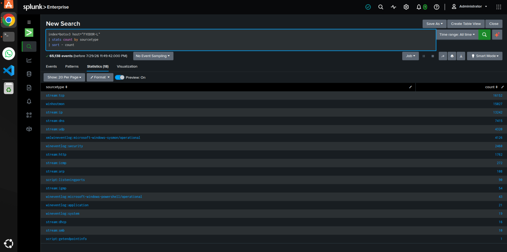
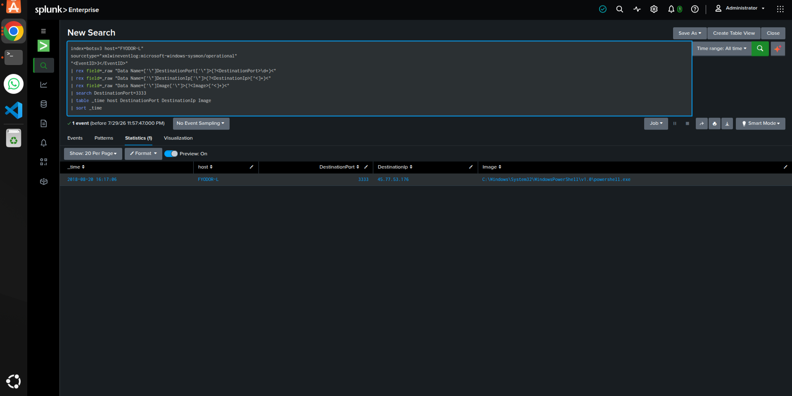
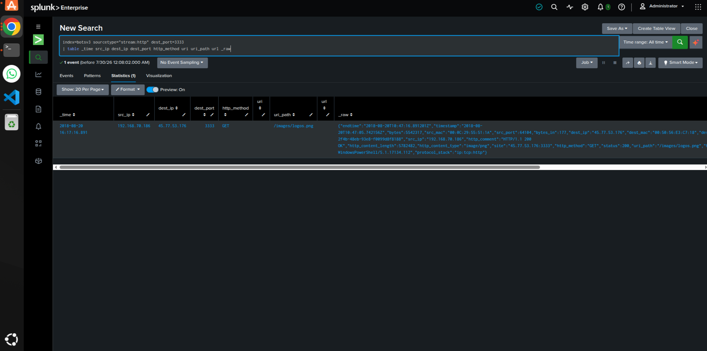
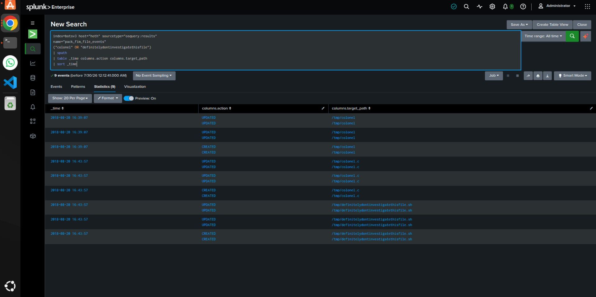
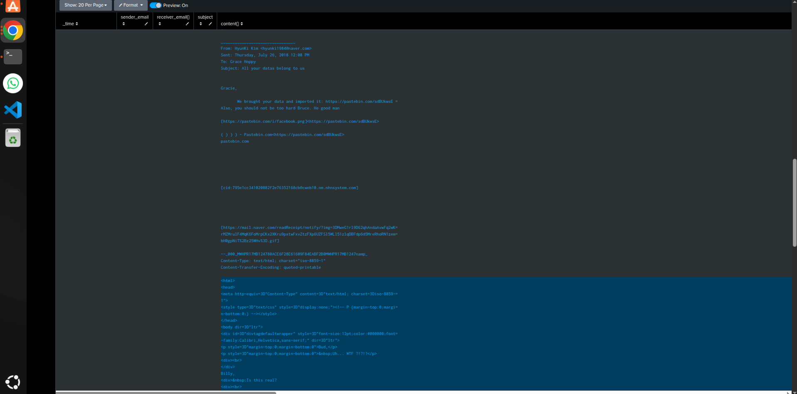
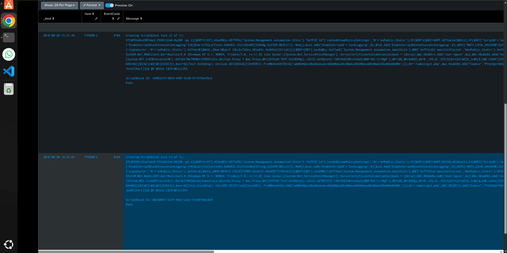
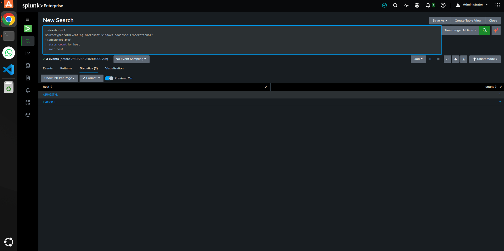

# COMP5002 - BOTSv3 Security Incident Investigation

## Table of Contents

1. [Introduction](#1-introduction)
2. [SOC Roles & Incident Handling Reflection](#2-soc-roles--incident-handling-reflection)
3. [Installation & Data Preparation](#3-installation--data-preparation)
4. [Guided Questions](#4-guided-questions)
5. [Conclusion](#5-conclusion)
6. [References](#references)
7. [Appendix A - Answer and Evidence Register](#appendix-a---answer-and-evidence-register)
8. [Appendix B - Generative AI Declaration](#appendix-b---generative-ai-declaration)

---

## 1. Introduction

A Security Operations Centre (SOC) rarely receives a complete story in one alert. One log may show an unusual connection, another may show a download, and a third may reveal what happened on a different host. The BOTSv3 exercise recreates that problem inside the fictional Frothly organisation by combining Windows, Linux, network and email telemetry in Splunk [1]. The purpose of this investigation was to follow those separate traces until they formed one defensible incident narrative rather than six disconnected quiz answers.

The investigation had three objectives. First, confirm that the Splunk environment and the BOTSv3 index were usable. Second, answer the assigned 300-level questions with repeatable SPL and visible evidence. Third, explain why each finding matters to a working SOC and what action should follow. The scope was limited to `FYODOR-L`, `ABUNGST-L`, the Linux host `hoth`, Grace Hoppy, and the related network indicators. BOTSv3 was treated as the available evidence set, but fields were not assumed to be correct until the raw event had been checked. No malware was executed and no external adversary service was visited.

The report follows the required assessment structure. It begins with the SOC role and incident-handling reflection, then documents the lab and data checks, presents the six guided findings, and closes with lessons for detection and response. The intended audience is a SOC manager, an incident responder and a detection engineer. Each needs a different level of detail, so the report gives the result, the evidence and the operational meaning together.

---

## 2. SOC Roles & Incident Handling Reflection

The exercise showed a clear split between SOC tiers. Tier 1 work was the early triage: confirm the host, note the unusual port and process, and decide whether the event deserved escalation. Port `3333` by itself was only unusual. The event became more serious when the process was PowerShell and the destination was an external IP. Tier 2 work began when the network event was linked to the HTTP download, Linux file activity, the exfiltration email and the PowerShell C2 path. Tier 3 work would turn those observations into correlation searches, dashboards and a better playbook. The important lesson was that stopping after the first correct answer would have missed the wider incident.

The investigation also mapped naturally to the NIST incident-handling lifecycle [2]. Preparation meant checking the index, sourcetypes, timestamps and field extraction before trusting any result. Detection and analysis involved moving from `FYODOR-L` to `stream:http`, then to Osquery, SMTP and PowerShell logs. Containment would require isolating `FYODOR-L` and `ABUNGST-L`, preserving `hoth`, blocking `45.77.53.176` and the known URI paths, and resetting credentials used on the affected laptops. Eradication would include removing staged files, scheduled tasks and any related persistence only after evidence had been captured. Recovery would require monitoring the restored hosts and running a broader hunt for the same indicators.

Prevention cannot guarantee that every malicious download is stopped. However, several controls could have reduced the impact: PowerShell logging, restricted script execution, egress filtering on uncommon ports, file-integrity monitoring on Linux temporary directories, and alerting for repeated C2 paths across hosts. The strongest reflection from the exercise is practical: an answer is not the end of an investigation. Every answer should produce either another search or a response decision.

---

## 3. Installation & Data Preparation

Splunk Enterprise 10.4.1 was operated in an isolated Ubuntu lab. Isolation was appropriate because it allowed unrestricted searching and inspection of suspicious script content without exposing a production network. The BOTSv3 data was loaded into the `botsv3` index. The first readiness query returned `2,083,056` events, confirming that the dataset was present. This simple check prevented a common mistake: treating a failed search as proof that the activity did not exist.

```spl
index=botsv3
| stats count
```



*Figure 1. BOTSv3 index validation showing 2,083,056 events.*

The next validation grouped `FYODOR-L` events by sourcetype. Eighteen sources were available, including `stream:http`, `stream:tcp`, Sysmon and PowerShell operational logs. The first Sysmon query had returned zero results because the coursework used a mixed-case sourcetype while this installation stored it in lowercase. The exact value was therefore copied from Splunk rather than assumed. This small correction mattered throughout the investigation.

```spl
index=botsv3 host="FYODOR-L"
| stats count by sourcetype
| sort - count
```



*Figure 2. Sourcetype coverage for FYODOR-L.*

Field validation was also necessary. Sysmon events were present, but `EventCode` and network fields were not automatically extracted. The raw XML showed `<EventID>3</EventID>` and `Data` elements containing `DestinationPort`, `DestinationIp` and `Image`, so `rex` was used to extract them. Osquery JSON was handled with `spath`. Searches used **All time** because BOTSv3 is historical. In a production SOC, `inputs.conf`, `indexes.conf`, time-zone handling, storage limits, retention and role-based access would also be documented. Incorrect parsing can produce a convincing but false timeline, so data assurance was treated as part of the investigation rather than an administrative step [3], [4].

A final validation compared timestamps and hostnames across the key sources before the incident sequence was written. The same destination IP appeared in both Sysmon and `stream:http`, and the host labels remained consistent in PowerShell records. This cross-check was basic, but useful. It reduced the risk of joining unrelated events simply because they contained a similar keyword. Screenshots were saved with descriptive filenames so another analyst could trace each conclusion back to the original Splunk result.

---

## 4. Guided Questions

The six findings are presented in the order that made sense during the investigation. Each subsection gives the answer, the SPL used, the evidence and the SOC relevance.

| Q | Finding | Answer | Primary source |
|---|---|---|---|
| 1 | Port used to download tools | `3333` | Sysmon |
| 2 | File inferred to contain tools | `logos.png` | `stream:http` |
| 3 | Files streamed to `/tmp` | `colonel,definitelydontinvestigatethisfile.sh` | Osquery |
| 4 | Customer emails exposed | `8` | `stream:smtp` |
| 5 | C2 URL path | `/admin/get.php` | PowerShell 4104 |
| 6 | Endpoints contacting C2 | `ABUNGST-L,FYODOR-L` | PowerShell 4104 |

### 4.1 Tool-transfer port on FYODOR-L

The Sysmon network search identified one event in which `powershell.exe` on `FYODOR-L` connected to `45.77.53.176` using destination port `3333`. The answer to Question 1 is therefore `3333`. The event was more meaningful than the number alone because the process was PowerShell, not an expected business application. That combination justified an immediate pivot to network traffic.

```spl
index=botsv3 host="FYODOR-L"
sourcetype="xmlwineventlog:microsoft-windows-sysmon/operational"
"<EventID>3</EventID>"
| rex field=_raw "Data Name=['\"]DestinationPort['\"]>(?<DestinationPort>\d+)<"
| rex field=_raw "Data Name=['\"]DestinationIp['\"]>(?<DestinationIp>[^<]+)<"
| rex field=_raw "Data Name=['\"]Image['\"]>(?<Image>[^<]+)<"
| search DestinationPort=3333
| table _time host DestinationPort DestinationIp Image
```



*Figure 3. PowerShell on FYODOR-L connecting to 45.77.53.176:3333.*

In a live SOC, `45.77.53.176`, port `3333` and the PowerShell command line should be hunted across all endpoints. The host should be isolated if the connection cannot be explained quickly.

### 4.2 Downloaded file

A `stream:http` search on port `3333` returned a single GET request to `/images/logos.png`. The required filename is `logos.png`. The harmless-looking image name should not reduce suspicion: it appeared on an uncommon port, from the same internal source, seconds after the PowerShell connection. The file extension may have been chosen to blend into normal web traffic.

```spl
index=botsv3 sourcetype="stream:http" dest_port=3333
| table _time src_ip dest_ip dest_port http_method uri_path _raw
```



*Figure 4. HTTP GET request for `/images/logos.png` over port 3333.*

The correct response would be to preserve the object, verify its real file type, calculate hashes and search for the same URI or filename elsewhere. Blocking the IP alone would be too narrow because infrastructure can change.

### 4.3 Files staged in `/tmp` on `hoth`

Osquery file-integrity monitoring on `hoth` showed `/tmp/colonel`, `/tmp/colonel.c` and `/tmp/definitelydontinvestigatethisfile.sh`. The two remotely streamed files were `colonel` and `definitelydontinvestigatethisfile.sh`; `colonel.c` appeared later and was treated as a generated file rather than part of the original transfer. The answer is therefore `colonel,definitelydontinvestigatethisfile.sh`.

```spl
index=botsv3 host="hoth" sourcetype="osquery:results"
name="pack_fim_file_events"
("colonel" OR "definitelydontinvestigatethisfile")
| spath
| table _time columns.action columns.target_path
| sort _time
```



*Figure 5. Osquery FIM evidence for the suspicious `/tmp` files.*

Files placed in `/tmp` are not automatically malicious, but these names and their sequence were unusual. A responder should preserve the files, collect hashes and permissions, inspect shell history, and check cron, systemd and SSH keys before deleting anything [6].

### 4.4 Customer data exposure

The SMTP investigation initially returned normal internal messages and large encoded attachments. Narrowing the search to Grace Hoppy and `hyunki1984@naver.com` revealed the adversary email with the subject **“All your datas belong to us.”** The body claimed that Frothly data had been uploaded to Pastebin. The verified number of exposed customer email addresses was eight.

```spl
index=botsv3 sourcetype="stream:smtp"
"ghoppy@froth.ly" "hyunki1984@naver.com"
| spath
| search content{}="*customers*"
| table _time sender_email receiver_email{} subject content{} attach_filename{}
```



*Figure 6. Adversary email to Grace Hoppy confirming stolen data and a Pastebin reference.*

A limitation remains: the Pastebin identifier appeared only in SMTP and no matching HTTP response was captured. The email and verified quiz result support the count, but the report does not claim that the external page was recovered. In a real breach, the SOC should involve privacy and legal teams, preserve the email and determine whether other customer fields were exposed.

### 4.5 Command-and-control path

PowerShell operational logging, especially EventCode `4104` script-block records, exposed the path `/admin/get.php` inside obfuscated PowerShell. The answer to Question 5 is `/admin/get.php`. Script-block logging was valuable because it showed content that process-creation events alone would not explain [5].

```spl
index=botsv3
sourcetype="wineventlog:microsoft-windows-powershell/operational"
(host="ABUNGST-L" OR host="FYODOR-L")
("/admin/get.php" OR "admin/get.php")
| table _time host EventCode Message _raw
| sort _time
```



*Figure 7. PowerShell 4104 evidence containing `/admin/get.php`.*

The path should be blocked where possible and hunted in proxy, DNS, endpoint and memory evidence. The surrounding encoded strings and User-Agent fragments should also be extracted because behavioural parts of the script may remain useful after the attacker changes the URL.

### 4.6 Endpoints contacting the C2 infrastructure

Aggregating events containing `/admin/get.php` by host produced `ABUNGST-L` and `FYODOR-L`. The exact answer is `ABUNGST-L,FYODOR-L`. This was the strongest scope-changing result in the investigation because it proved that the activity was not limited to `FYODOR-L`. A single-device cleanup would have left another compromised endpoint active.

```spl
index=botsv3
sourcetype="wineventlog:microsoft-windows-powershell/operational"
"/admin/get.php"
| stats count by host
| sort host
```



*Figure 8. Host aggregation showing `ABUNGST-L` and `FYODOR-L`.*

Both laptops should be isolated, memory and PowerShell logs preserved, scheduled tasks reviewed and credentials reset. A wider hunt should search for the same path, destination IP, script structure and unusual PowerShell network behaviour across Frothly.

### 4.7 Integrated incident view

Placed together, the evidence shows a clearer sequence than any single query could provide. At 16:17, `FYODOR-L` used PowerShell to reach `45.77.53.176:3333`, followed immediately by the GET request for `logos.png`. Later, `hoth` recorded the creation and modification of suspicious files under `/tmp`. The exfiltration email appeared after those technical events, and the PowerShell script-block records demonstrated that the same C2 path existed on two Windows laptops. This ordering does not prove every missing step, but it supports a high-confidence assessment that the attacker transferred tools, staged activity, stole customer data and maintained communication with more than one endpoint.

The evidence also has limits. The actual contents of `logos.png` were not analysed, the Pastebin page was not present in captured HTTP traffic, and the relationship between the Windows and Linux activity cannot be proven solely from these six questions. Those gaps should remain visible. A good SOC report should separate what the logs prove from what they strongly suggest. In this case, the indicators are sufficient for urgent containment, while deeper host forensics would be needed to confirm execution chains, persistence methods and the exact data removed.

---

## 5. Conclusion

The six questions form one incident sequence. PowerShell on `FYODOR-L` contacted `45.77.53.176` over port `3333` and downloaded `logos.png`. Osquery then showed suspicious files staged in `/tmp` on `hoth`. The adversary email confirmed that eight customer email addresses had been exposed. PowerShell script-block logs identified `/admin/get.php` on both `ABUNGST-L` and `FYODOR-L`. The combined evidence supports tool transfer, Linux staging, data theft and shared command-and-control activity.

Several practical improvements follow. Detection should combine PowerShell with uncommon outbound ports and image-named downloads. Linux FIM alerts should give extra weight to new scripts or executable files in `/tmp`. Repeated C2 paths across multiple endpoints should trigger immediate scope expansion. A telemetry-health dashboard should also track source volume, last-seen time, extraction success and clock drift. The most important lesson is that reliable incident response begins before the first alert: data must be present, parsed correctly and checked against the raw record. Once that foundation exists, separate clues can be turned into a fast and defensible response.

---

## References

[1] Splunk, “Boss of the SOC Version 3 Dataset,” GitHub. [Online]. Available: https://github.com/splunk/botsv3. [Accessed: 30-Jul-2026].

[2] National Institute of Standards and Technology, “Computer Security Incident Handling Guide,” NIST SP 800-61 Rev. 2, Aug. 2012, doi: 10.6028/NIST.SP.800-61r2.

[3] Splunk, “Search Reference,” Splunk Documentation. [Online]. Available: https://docs.splunk.com/Documentation/Splunk/latest/SearchReference/. [Accessed: 30-Jul-2026].

[4] Microsoft, “Sysmon,” Microsoft Learn. [Online]. Available: https://learn.microsoft.com/en-us/sysinternals/downloads/sysmon. [Accessed: 30-Jul-2026].

[5] Microsoft, “About Logging Windows PowerShell,” Microsoft Learn. [Online]. Available: https://learn.microsoft.com/en-us/powershell/module/microsoft.powershell.core/about/about_logging_windows. [Accessed: 30-Jul-2026].

[6] Osquery, “File Integrity Monitoring,” Osquery Documentation. [Online]. Available: https://osquery.readthedocs.io/en/stable/deployment/file-integrity-monitoring/. [Accessed: 30-Jul-2026].

---

## Appendix A - Answer and Evidence Register

| Question | Answer | Figure | Evidence filename |
|---|---|---|---|
| Q1 | `3333` | Figure 3 | `evidence/03_Q1_Port_3333.png` |
| Q2 | `logos.png` | Figure 4 | `evidence/04_Q2_Logos_PNG.png` |
| Q3 | `colonel,definitelydontinvestigatethisfile.sh` | Figure 5 | `evidence/05_Q3_TMP_Files.png` |
| Q4 | `8` | Figure 6 | `evidence/06_Q4_Exfiltration_Email.png` |
| Q5 | `/admin/get.php` | Figure 7 | `evidence/07_Q5_C2_Path.png` |
| Q6 | `ABUNGST-L,FYODOR-L` | Figure 8 | `evidence/08_Q6_C2_Hosts.png` |

---

## Appendix B - Generative AI Declaration

ChatGPT was used to help organise the report structure. Splunk installation, searches, validation, interpretation and screenshot selection were completed by the student. Responsibility for the final technical conclusions remains with the student.


